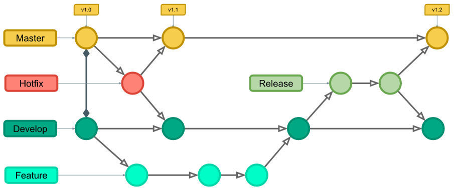

# Git - Controle de Versionamento de Código

## Comandos

### Instalação e Configuração do git

#### Instalação do Git no Linux (Ubuntu)

- Execute o comando: `apt-get install git`
- Para demais sistemas entre no [site do Git](https://git-scm.com/) e siga as instruções.

#### Configurações iniciais do Git

```bash
# Configurar Nome e E-mail do usuário
git config --global user.name "User Name"
git config --global user.email my_email@email.com"
```

```bash
# Listar Configurações
git config --list
```

#### Integração com o repositório do GitHub

- Terminal:
  - gerar chave SSH: `ssh-keygen -t rsa -b 4096 -C "meu_email@email.com"`
  - mostrar chave pública (copiar): `cat ~/.ssh/id_rsa.pub`
- GitHub > profile > settings
- SSH and GPG Keys > SSH Keys > **New SSH Key**
  - Key: cole a chave pública
  - **Add SSH Key**

### Comandos de rotina

```bash
git init
```

```bash
git status
```

```bash
git add .
```

```bash
git commit -m "mensagem"
```

```bash
git push
```

```bash
git pull
```

### Trabalhar com Branchs

```bash
# local
git branch
# repositório remoto
git branch -r
```

```bash
# alternar entre as branchs
git checkout new-branch
# criar e alternar para a nova branch
git checkout -b new-branch
```

```bash
# boa prática: deletar as branchs não mais utilizadas
# apagar local
git branch
git branch -d branch-name
# apagar no repositório remoto
git branch -r
git push origin --delete branch-name
```

### Trabalhar com Tags

```bash
# Listar suas Tags
git tag
# Listar filtrando um padrão (aceita wildcard '*')
git tag -l "v1.0.*"
```

```bash
# Criar uma Tag
git tag new-tag
```

```bash
# Excluir uma Tag
# excluir no local
git tag -d my-tag
# excluir no repositório remoto
git tag push origin --delete my-tag
```

### Trabalhando com repositórios remotos

```bash
git clone
```

```bash
git remote -v
```

### Git Flow

O Git Flow é um modelo ou estratégia de fluxo de trabalho muito utilizado por equipes de desenvolvimento de software. Tem o objetivo de melhorar a organização das Branches, dando fluidez ao processo de desenvolvimento de novas funcionalidades, correções de bugs e lançamentos de versões.

- Não é recomendado para projetos que exigem Entrega Contínua e práticas de DevOps (Trunk-based development)
- Indicado para projetos com versionamento semântico, podendo possuir um ciclo de entrega agendada
- Duas branches principais: Develop e Master/Main (permanentes)
- Três branches secundarias: Feature, Release e Hotfix (temporárias até realizar o merge com as branches principais)
- Branch Release: serve como ponte para fazer o merge da Develop para a Master (homologação)
- É ideal que todos os commits na branch Master/Main tenham uma Tag com um número de versão


