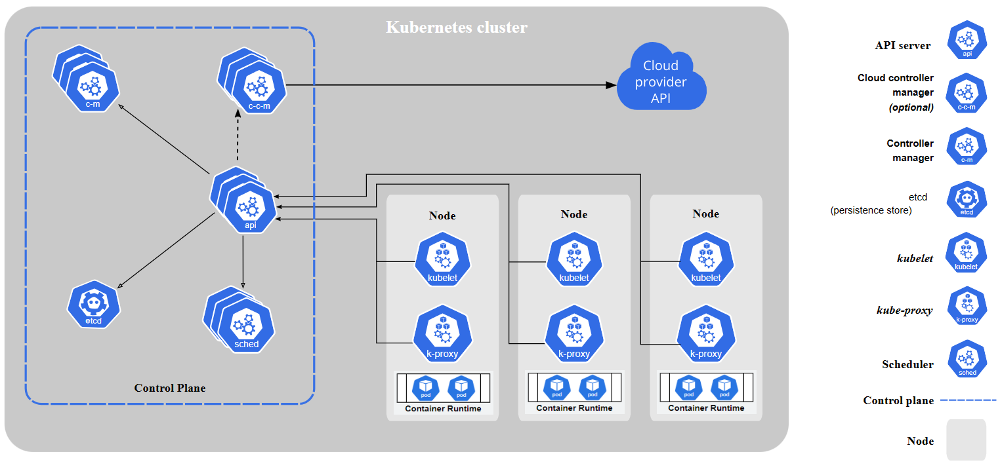

# Kubernetes - Orquestração de Containers

## Arquitetura



- Master (node): responsável por gerenciar todas as operações do cluster
  - **Kube-apiserver**: ponto de entrada para todas as operações do cluster - API rest
  - **Kube Controller Manager** / **Cloud Controller Manager**: manter o estado do cluster
  - **kube-scheduler**: responsável pela alocação dos PODs nos workers
  - **etcd**: armazena os arquivos de configuração do kubernetes
  - **Container Runtime**: runtime de execução dos PODs (Docker; ContainerID)

- Worker Nodes:
  - **kubelet** (agent): agente que gerencia os PODs alocados no node
  - **kube-Proxy**: lidar com o roteamento de rede do node
  - **Container Runtime**: K8s é compatível com Docker, ContainerID e outros

## Fundamentos

- **Pod**: menor unidade do k8s; única instância de um aplicativo

```yaml
apiVersion: v1
kind: Pod
```

- **ReplicaSet**: conjunto de Pods; garantir a disponibilidade

```yaml
apiVersion: apps/v1
kind: ReplicaSet
```

- **Deployment**: estratégias de rollout; rollback para gerenciar atualização de aplicativos (add-on: flagger p/ outros tipos de deploy - canary, AB)
  - o **Rolling Update** é a estratégia de rollout padrão no Kubernetes: pods antigos são gradualmente substituídos por novos durante a atualização, garantindo o nº de réplicas desejado e a disponibilidade da aplicação durante a atualização.

```yaml
apiVersion: apps/v1
kind: Deployment
```


- **Services**: fornece um IP virtual; fica na frente do Pod e atua como balanceador de carga
- Kubernetes **Disks** - persistent volume (PV) - armazenamento persistente:
  - Persistent Volumes: tipo do armazenamento (AKS: Azure Disk; Azure Files)
  - Storage Classes: classe de armazenamento (AKS: standard; premium)
  - Persistent Volume Claims: provisionamento dinâmico
- Kubernetes **Requests & Limits**:
  - Requests e Limits são dois parâmetros importantes usados para configurar os recursos que um contêiner pode usar em um nó do cluster em "CPU" e "Memória".
  - Requests: qtde mínima de recursos (CPU; Mem)
  - Limits  : qtde máxima de recursos (CPU; Mem)
  - Ajudam o Kubernetes a gerenciar melhor os recursos disponíveis e garantir um desempenho estável e previsível para os aplicativos em execução.
  - Unidades: CPU - "m" (milicores de CPU); Memória - "Mi" (megabytes)
- Kubernetes **HPA** (Horizontal Pod Autoscaler):
  - escala horizontal automática de Pods em um deployment ou replicaset
  - monitora métricas específicas como a utilização da CPU ou definida pelo usuário
  - garante que a aplicação tenha recursos computacionais adequados para lidar com variações na carga de trabalho
- Kubernetes **Namespaces**; boas práticas:
  - um cluster kubernetes para cada ambiente (dev; hml; prd)
  - um Namespace no cluster para cada aplicação (app1; app2; ...)
- **Health Check**: mecanismo usado para avaliar o estado de um aplicativo ou serviço em execução em um contêiner. A finalidade principal do Health Check é garantir que os aplicativos estejam funcionando corretamente e identificar qualquer instância que possa estar em um estado de falha.
  - Liveness Probe (vivacidade): ver se um container está em execução corretamente
  - Readiness Probe (prontidão): ver se um container está pronto para receber tráfego
  - Startup Probe: ver se um container está em processo de inicialização

### Kubernetes Services

- **ClusterIP** (internal): comunicação interna entre Pods - frontend acessando backend

```yaml
apiVersion: v1
kind: Service
```

- **NodePort** (to internet): acessar aplicativos usando portas de work nodes (acessar pelo navegador)

```yaml
apiVersion: v1
kind: Service
spec:
  type: NodePort
```

- **LoadBalancer** (to internet): serviço k8s LoadBalancer que será mapeado para o balanceador de carga no provedor Cloud - (Azure Standard LB; AWS ELB)

```yaml
apiVersion: v1
kind: Service
spec:
  type: LoadBalancer
```


- **Ingress** (to internet): balanceador de carga avançado de camada 7 (AWS ALB por ex.)

```yaml
apiVersion: networking.k8s.io/v1
kind: Ingress
```


- **externalName**: permite criar um alias para um serviço externo, especificando um nome de host externo. Ele não cria um balanceador de carga ou IP interno no cluster, mas permite que os pods dentro do cluster se comuniquem com o serviço externo usando o nome de serviço do Kubernetes. (ex.: acessar DB AWS RDS por app presente no cluster k8s)

```yaml
apiVersion: v1
kind: Service
metadata:
  name: my-externalname
spec:
  type: ExternalName
  externalName: exemplo.com
  ports:
    - protocol: TCP
      port: 80
      targetPort: 80
```

**Arquitetura básica exemplificando conectividade externa/interna entre *front-end* e *back-end* de uma aplicação no Cluster:**


### Serviços gerenciados de Kubernetes em Cloud

- Azure: **AKS** - Azure Kubernetes Service
- AWS: **EKS** - Elastic Kubernetes Service

## Lista de Comandos

Utilizando o **kubectl** que é a CLI (interface de linha de comandos) do Kubernetes.

### Pods

```bash
# Criar um Pod
# kubectl run <desired-pod-name> --image <container-image>
kubectl run my-first-pod --image iesodias/nginx-images:v1
```

```bash
# Listar Pods
kubectl get pods
kubectl get pods -o wide
```

```bash
# Descrever um Pod
# kubectl describe pod <pod-name>
kubectl describe my-first-pod
```

```bash
# Excluir um Pod
# kubectl delete pod <pod-name>
kubectl delete my-first-pod
```

```bash
# Executar comando para interagir (entrar) dentro de um Pod
# kubectl exec -it <pod-name> -- sh
kubectl exec -it my-first-pod -- sh
```

### ReplicaSet

```bash
# Listar ReplicaSets
kubectl get replicaset
kubectl get rs
kubectl get rs my-replicaset
```

```bash
# Excluir um ReplicaSet
# kubectl delete rs <replicaset-name>
kubectl delete rs my-replicaset
```

### Deployment

```bash
# Criar um Deployment com 3 réplicas
# kubectl create deployment <deploy-name> --image=<nome-imagem:tag> --replicas=<num-replicas>
kubectl create deployment meu-aplicativo --image=minha-imagem:versao --replicas=3
```

```bash
kubectl get deploy
# kubectl get deployment <deploy-name>
kubectl get deployment my-deploy
kubectl get deployment my-deploy -o yaml  # carrega o arquivo YAML do Deployment
# kubectl describe deployment <deploy-name>
kubectl describe deployment my-deploy
```

```bash
# kubectl edit deployment <deploy-name>
kubectl edit deployment my-deploy  # edita o arquivo YAML do Deployment
# kubectl scale --replicas=<num-replicas> deployment.apps/<deploy-name>
kubectl scale --replicas=10 deployment.apps/my-deploy  # edita o número de réplicas no Deployment
```

```bash
# Excluir um Deployment
# kubectl delete deploy <nome-deploy>
kubectl delete deploy my-deploy
```

### Services

```bash
# Obter informações de Serviços
kubectl get service
kubectl get svc
```

```bash
# Descrever um Serviço
# kubectl describe service <service-name>
kubectl describe service my-first-service
```

```bash
# Load Balancer Service (Expor um Pod)
# kubectl expose pod <pod-name> --type=LoadBalancer --port=<porta> --name=<service-name>
kubectl expose pod my-first-pod --type=LoadBalancer --porta=80 --name=my-first-service
```

```bash
# Load Balancer Service (Expor um ReplicaSet)
kubectl expose rs <nome-ReplicaSet> --type=LoadBalancer --port=80 -- target-port=8080 --name=<nome-Service>
# obs.: <nome-Service> poder ser o próprio <nome-ReplicaSet>
```

```bash
# Load Balancer Service (Expor um Deployment)
kubectl expose deployment <nome-deploy> --type=LoadBalancer --port=80 -- target-port=8080 --name=<nome-Service>
# obs.: <nome-Service> poder ser o próprio <nome-deploy>
```

```bash
# Para acessar a Aplicação
http://<External-IP-from-get-service-output>
```

```bash
# Excluir um Service
# kubectl delete svc <nome-Service>
kubectl delete svc my-service
```

### YAML (Manifestos do Kubernetes - arquivos de definições)

```yaml
# Estrutura básica
apiVersion:
Kind:
metadata:
spec:
```

```yaml
# Pod: definição simples para criação de um Pod (ex.: "meu-manifeto.yaml" com conteúdo abaixo)
apiVersion: v1
Kind: Pod
metadata: # Dict
  name: my-first-pod
  labels:
    app: my-first-pod
spec:
  containers: # List
    - name: my-first-pod
      image: iesodias/nginx-images:v1
      ports:
        - containerPort: 8080
```

```bash
# Criar os recursos a partir de um Manifesto Kubernetes (arquivo de configuração)

# kubectl create -f <nome-arq-manifesto.yaml>
kubectl create -f meu-manifesto.yaml

# kubectl apply -f <nome-arq-manifesto.yaml>
kubectl apply -f meu-manifesto.yaml
```

```yaml
# ReplicaSet: mantém 3 réplicas do pod definido na seção "template"
apiVersion: apps/v1
kind: ReplicaSet
metadata:
  name: my-replicaset
spec:
  replicas: 3
  selector:
    matchLabels:
      app: my-first-pod
  template:
    metadata:
      labels:
        app: my-first-pod
    spec:
      containers:
      - name: my-first-pod
        image: minha-imagem:versao
```

```yaml
# Deployment: especificando três réplicas em execução
apiVersion: apps/v1
kind: Deployment
metadata:
  name: my-first-app
spec:
  replicas: 3
  selector:
    matchLabels:
      app: my-first-app
  template:
    metadata:
      labels:
        app: my-first-app
    spec:
      containers:
      - name: meu-container
        image: minha-imagem:versao
        ports:
        - containerPort: 8080
```

```yaml
# Deployment: especificando três réplicas em execução
# Utilizando o "Rolling Update" que é a estratégia de rollout padrão no Kubernetes
apiVersion: apps/v1
kind: Deployment
metadata:
  name: meu-app
spec:
  replicas: 3
  strategy:
    type: RollingUpdate
    rollingUpdate:
      maxUnavailable: 1 # nro máximo de pods que podem estar indisponíveis durante a atualização.
      maxSurge: 1 # nro máx. de pods adicionais criados além do número desejado durante a atualização
  selector:
    matchLabels:
      app: meu-app
  template:
    metadata:
      labels:
        app: meu-app
    spec:
      containers:
        - name: meu-container
          image: meu-app:latest
          ports:
          - containerPort: 8080

```

```yaml
# ClusterIP Service: cria um IP interno (apenas acessível dentro do cluster)
apiVersion: v1
kind: Service
metadata:
  name: my-clusterip
spec:
  selector:
    app: my-first-pod
  ports:
    - protocol: TCP
      port: 80
      targetPort: 8080
```

```yaml
# NodePort Service: abre uma porta no nó (node) onde o serviço está sendo executado
apiVersion: v1
kind: Service
metadata:
  name: my-nodeport
spec:
  selector:
    app: my-first-pod
  ports:
    - protocol: TCP
      port: 80
      targetPort: 8080
  type: NodePort
```

```yaml
# LoadBalancer Service: balanceador de carga externo (LoadBalancer) para encaminhar o tráfego para os pods
apiVersion: v1
kind: Service
metadata:
  name: my-loadbalancer
spec:
  selector:
    app: my-first-pod
  ports:
    - protocol: TCP
      port: 80
      targetPort: 8080
  type: LoadBalancer
```

```yaml
# Ingress: utilizando o nginx Ingress controller
apiVersion: networking.k8s.io/v1
kind: Ingress
metadata:
  name: my-nginx-ingress
  annotations:
    kubernetes.io/ingress.class: nginx
spec:
  rules:
  - http:
    paths:
    - path: /
      pathType: Prefix
      backend:
        service:
          name: meu-servico
          port:
            number: 80
```

```yaml
# Rquests & Limits: definir requests e limits dos recursos (CPU/Mem) em um Deployment de uma aplicação
apiVersion: apps/v1
kind: Deployment
metadata:
  name: my-app
spec:
  replicas: 3
  selector:
    matchLabels:
      app: my-app
  template:
    metadata:
      labels:
        app: my-app
    spec:
      containers:
        - name: my-app-container
          image: sua-imagem:tag
          resources:
            requests:
              cpu: "500m"
              memory: "256Mi"
            limits:
              cpu: "1000m"
              memory: "512Mi"
```

```yaml
# HPA: escalar baseado no uso CPU - mín 2 réplicas, máx. 5 réplicas; utilização da CPU de 50%
apiVersion: apps/v1
kind: Deployment
metadata:
  name: meu-aplicativo
spec:
  replicas: 2
  selector:
    matchLabels:
      app: meu-aplicativo
  template:
    metadata:
      labels:
        app: meu-aplicativo
    spec:
      containers:
      - name: meu-container
        image: minha-imagem:tag
        ports:
        - containerPort: 80
        resources:
          requests:
            cpu: "200m"
            memory: "256Mi"
          limits:
            cpu: "500m"
            memory: "512Mi"
---
apiVersion: autoscaling/v2
kind: HorizontalPodAutoscaler
metadata:
  name: meu-aplicativo-hpa
spec:
  scaleTargetRef:
    apiVersion: apps/v1
    kind: Deployment
    name: meu-aplicativo
  minReplicas: 2
  maxReplicas: 5
  metrics:
  - type: Resource
    resource:
      name: cpu
      target:
        type: Utilization
        averageUtilization: 50
```

```yaml
# Health Check: definição para um Pod com readinessProbe (prontidão) e livenessProbe (vivacidade)
apiVersion: v1
kind: Pod
metadata:
  name: mypod
spec:
  containers:
  - name: mycontainer
    image: myimage
    readinessProbe:
      httpGet:
        path: /healthz
        port: 8080
      initialDelaySeconds: 3
      periodSeconds: 5
    livenessProbe:
      httpGet:
        path: /healthz
        port: 8080
      initialDelaySeconds: 3
      periodSeconds: 5
```
